# NFL Fantasy League
## _devops-fundamental-project_
---
## Contents
* [Introduction](#introduction)
	* [Objective](#objective) 
	* [Outline](#outline) 
		* [CRUD Functionality](#crud-functionality)
* [Project Plan](#project-plan)
	* [Continuous Integration Pipeline](#continuous-integration-pipeline)
	* [Risk Assessment](#risk-assessment)  
	* [Scrum Board](#scrum-board)
	* [Entity-Relationship Diagram](#entity-relationship-diagram)
* [Development](#development)
	* [Unit Testing in VS Code](#unit-testing-in-vs-code)
	* [Unit Testing with CI server](#unit-testing-with-ci-server)
	* [Front-End](#front-end)
* [Footer](#footer)
	* [Future Improvements](#future-improvements)
	* [Author](#author)
	* [Acknowledgements](#acknowledgements)

  

## Introduction
---
 

### Objective

The overall objective with this project is the following: 

	- To create a CRUD application with utilisation of supporting tools, 
	  methodologies and technologies that encapsulate all core modules 
	  covered during training. 

 

### Outline

The application being created for this project is an NFL fantasy football league. The CRUD functionality was updated to discount user logins, as this feature was out of scope for the project. The initial CRUD outline that was planned can be found [here.](./initial-crud.md)  
 

#### _CRUD functionality_

Users will be able to:
* **Create** multiple NFL fantasy leagues.
* **Create** multiple NFL fantasy teams.
* **Create** multiple players to populate each NFL fantasy team.
  

* **Read** the NFL teams that belong to a fantasy league.
* **Read** a list of players that belong to each fantasy NFL team.
  

* **Update** team roster (e.g. Add/remove players or move up some players from the bench).
* **Update** the attributes of each player (e.g. name, player position, and team)
* **Update** the name of each team.
* **Update** the name of each league.
  

* **Delete** a player.
* **Delete** a fantasy team.
* **Delete** a fantasy league.

  

## Project Plan
---
 

### Continuous Integration Pipeline

The tech stack I used for this project is as follows: 

	- Scrum Board/Project Tracking: Jira
	- Database: GCP SQL Server 
	- Programming language: Python 
	- Unit Testing with Python: Pytest  
	- Front-end: Flask
	- Version Control System: GitHub
	- CI Server: Jenkins 
	- Cloud server: GCP Compute Engine

 

The key components of the Continuous Integration (CI) pipeline and how they relate to each other can be described like this:

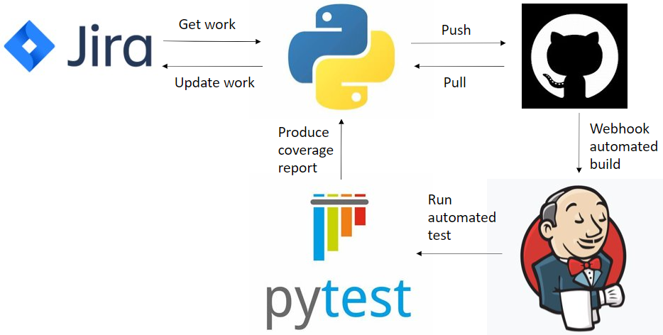

 

### Risk Assessment

Here is a link to my [Risk Assessment](https://qalearning-my.sharepoint.com/:x:/r/personal/gwilliams_qa_com/_layouts/15/Doc.aspx?sourcedoc=%7B7FD04526-D564-496A-96F8-6422906C291D%7D&file=Risk%20Assessment.xlsx&wdOrigin=OFFICECOM-WEB.START.REC&ct=1626710319117&action=default&mobileredirect=true&wdLOR=c7EE92B46-79E5-4BBE-AB20-35CBAE3EAF72&cid=59cf5c39-c7d5-4e74-a919-d19be51b63c2)
, as well as the image below where I have detailed descriptions of the potential risks and control measures associated with this project. It can be seen that I have re-visited the risk assessment multiple times throughout the project where new risks became clear, such as when I learnt more about how to use Flask and Jenkins.

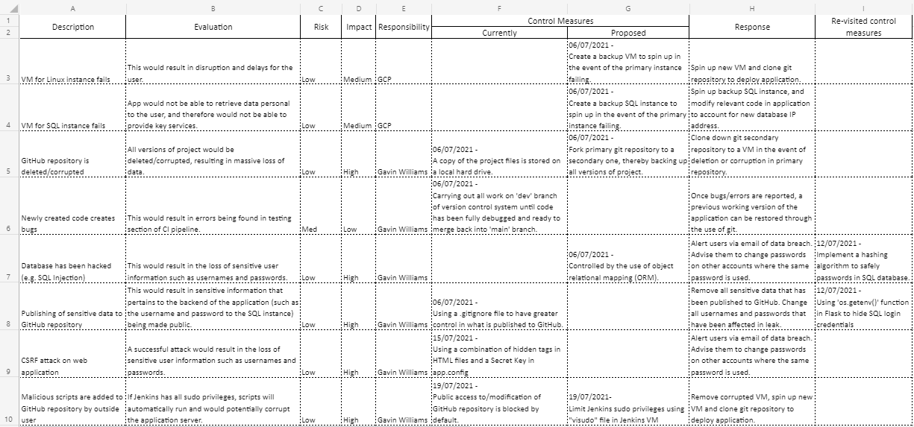

 

### Scrum Board

I decided to use Jira for my Scrum Board, as I like the general layout and options it gives to the user.
Here is a link to my [Scrum Board.](https://team-1624354737559.atlassian.net/jira/software/projects/DFP/boards/4/roadmap)

My completed project road map is as follows:

Firstly, I planned a list of tasks from a project development standpoint, such as writing out a risk assessment and designing an ERD diagram.

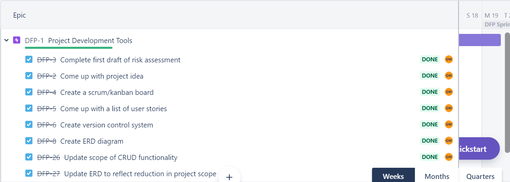

  

Secondly, I wrote a list of user stories. These were a guide to what I wanted the functionality of my application to incorporate, such as allowing the user to create multiple teams in a fantasy league.

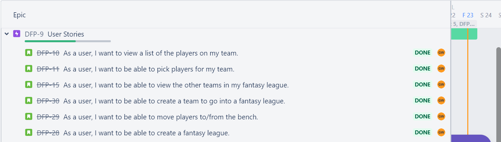
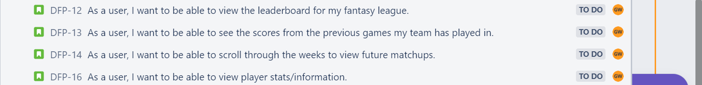

  

Lastly, I planned a list of tasks based off of creating a continuous integration (CI) pipeline for my flask application.

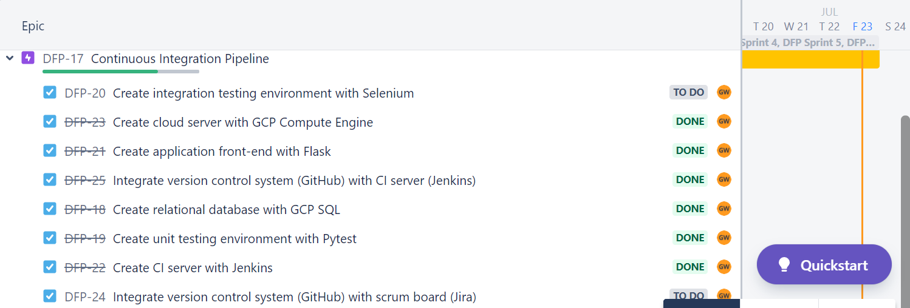

  

### Entity-Relationship Diagram
	
Here is the initial Entity-Relationship Diagram (ERD) for this project, which incorporates user logins:
	
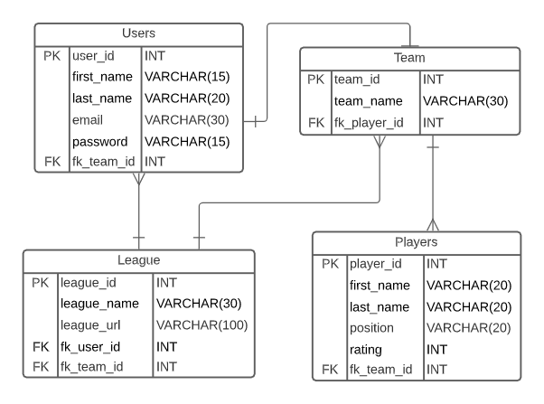

  
Here is the final version of the ERD, created to reflect the change in CRUD functionality where user logins are no longer required, and thus has one less table. I also simplified the League and Players tables, where a league URL would not need to be stored in the database, and a player rating would be desirable, but ultimately not necessary for the scope of this application. One small addition I made was to include an "active" attribute to each player, which allows the user to mark each player as active or inactive. This function meets the user story example of wanting to move players to/from the bench.

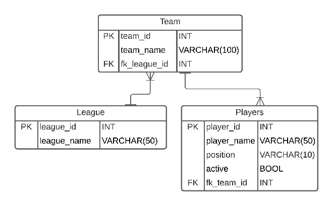

This can be read as:  
One league can have many teams. One team can have many players. Many players can only be in one team. Many teams can only be in one league.

  

## Development
---
 

### Unit Testing in VS Code

For the unit testing phase, I wrote tests to check that all of the [CRUD functionality](#crud-functionality) was working. These classes, such as "TestCreate", can be further broken down into functions, such as "test_create_league".

Here is the testing output carried out after completing the application, giving 100% coverage of the "application" directory:

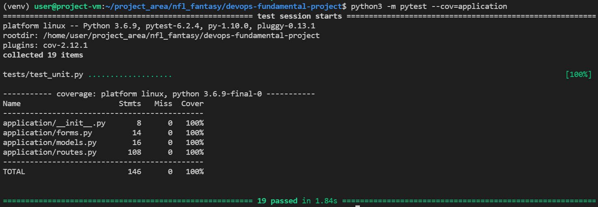

 

### Unit Testing with CI server

Here is the code used to create the Jenkins build. It is essentially all of the code a developer would need to input into the terminal of the VM if they were to run pytest. This includes installing python3 and a virtual environment. The "venv" creates a directory where we can install all the executable files needed to run a python project (e.g. for this project we need pytest and flask). This code also produces a coverage report linked with Cobertura and a unit test evaluation with JUnit:

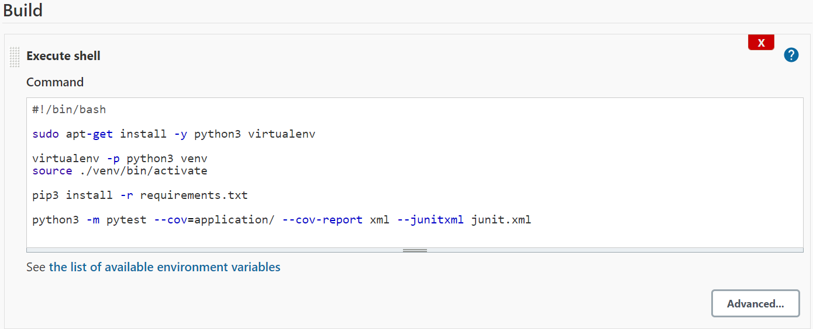

  

Here is the testing output using Jenkins with JUnit and Cobertura coverage reports, which shows a successful build:

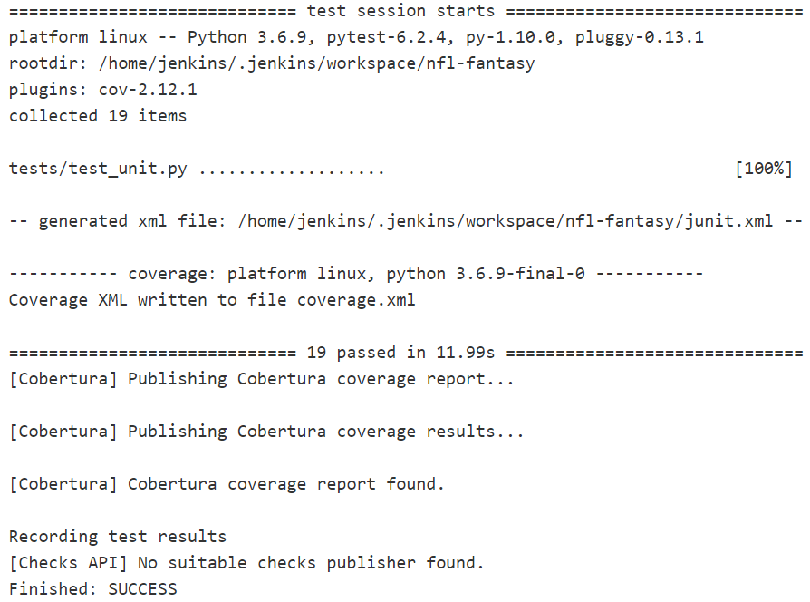

  

Here is the Cobertura coverage report, which shows 100% coverage across all areas of the application:

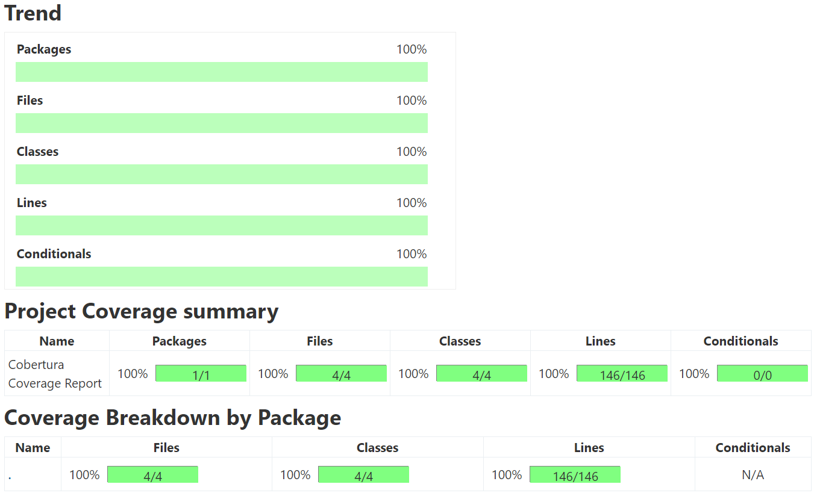

  

Here is the JUnit test output, which reports 0 failures for every function in every test class:

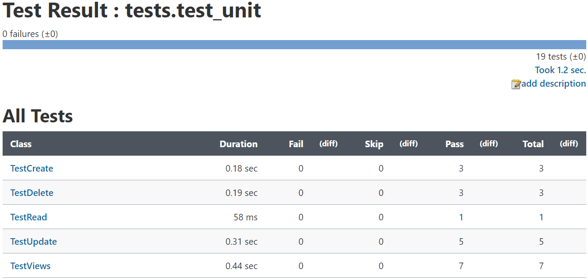

  

Here is the webhook configured to trigger a Jenkins build once there has been a push to GitHub. This allows for automated testing for every change that is made to the source code:

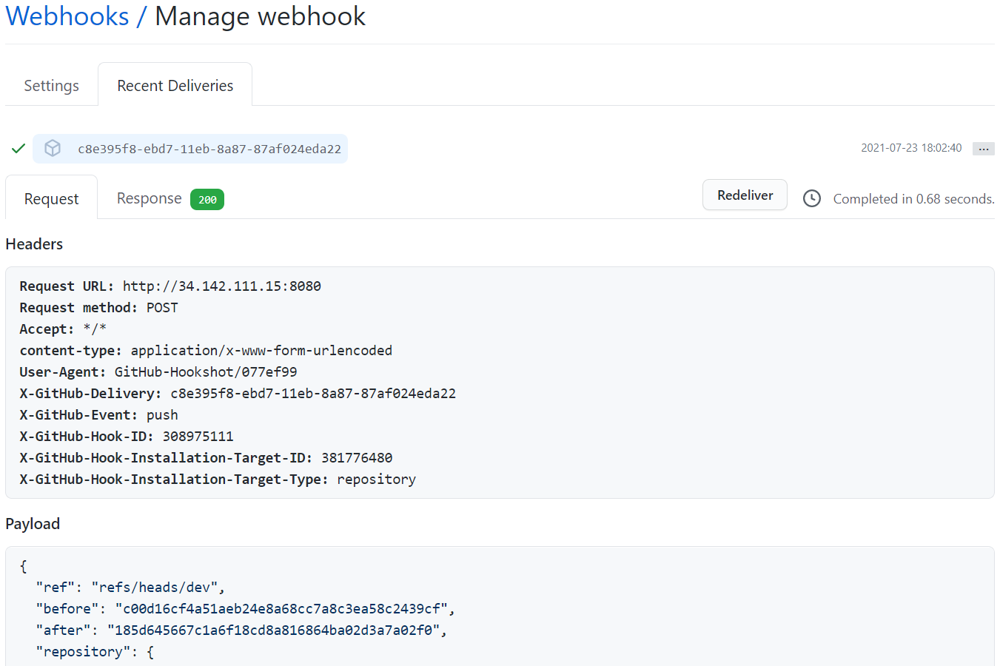

  

### Front-End

Here is what the user sees when they first open the application:

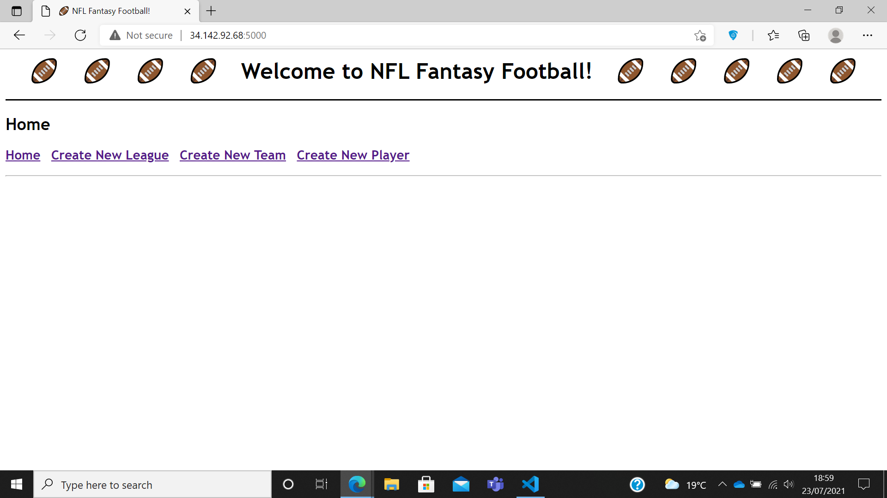

 

The user can first create a fantasy league by clicking "Create New League":

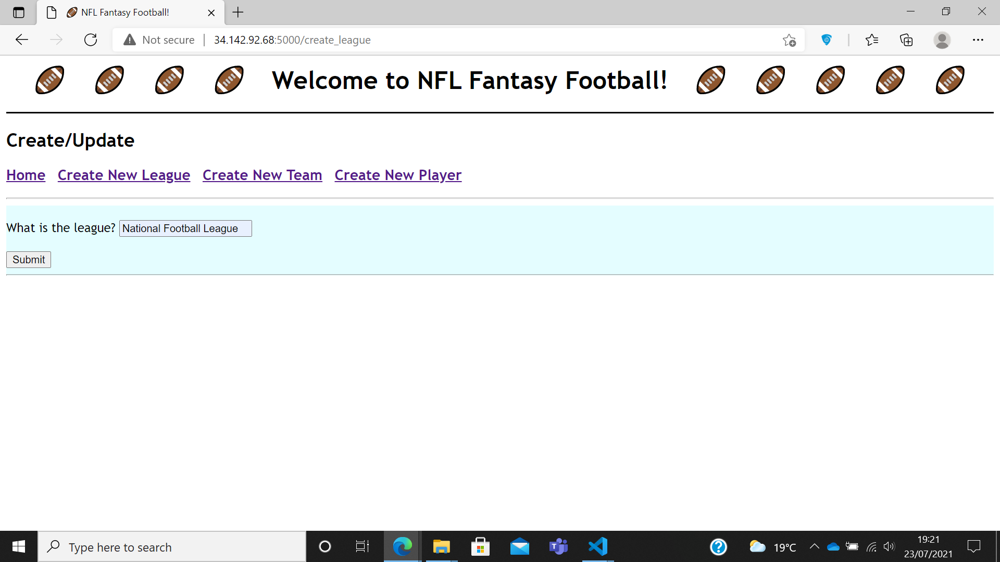

 

When the user has filled in the form and clicked "Submit", the user will be redirected to the home page where the fantasy league will be displayed:

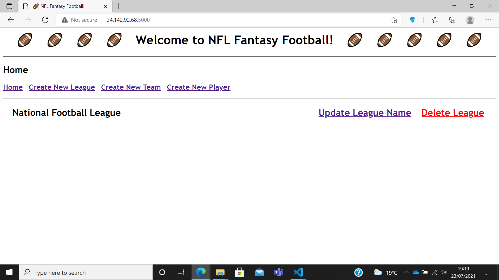

 

Now the user can create a team to go into that league by clicking "Create New Team":

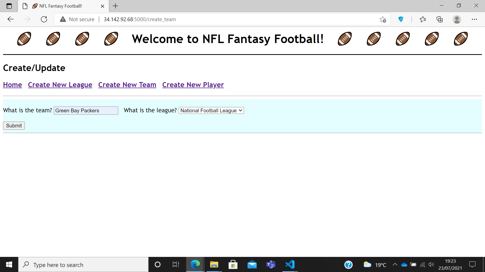

 

Now the user can fill in the form with the team name and select the league from the drop-down list. Again, the user will be redirected to the home page to see the fantasy league has been populated by the newly created team:

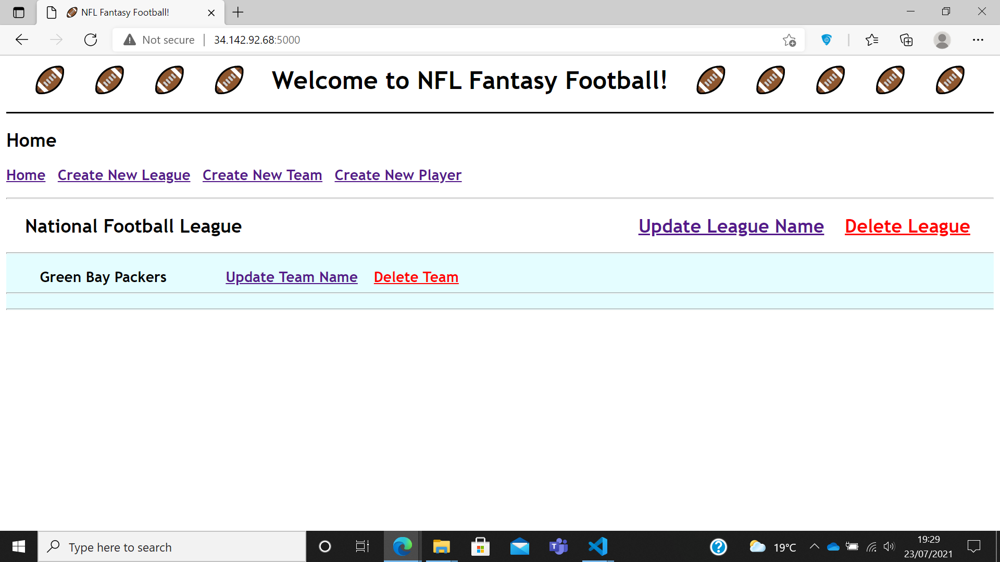

 

The user can add a player to this team by clicking "Create New Player":

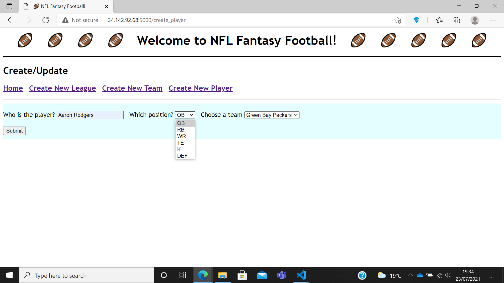

 

From here, the user can fill in the player name, select the player position from the drop-down list, and select the team from the other drop-down list. When the user gets redirected again, the user will find the newly created player added to the selected team:

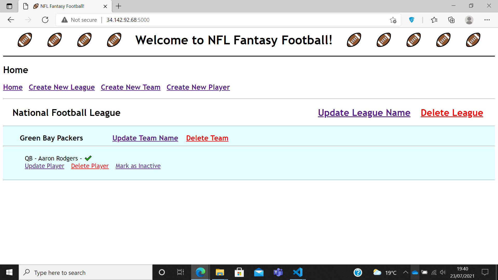

 

If the user wishes to add a player to the bench, they can mark the player as inactive by clicking on "Mark as Inactive" like so:

 

## Footer
---
 

### Future Improvements

For future sprints I would:
* Implement integration testing with Selenium.
* Add a user login feature to improve the security of data stored in the SQL database.
* Add a scoring system and a matchup schedule, where the user can view a leaderboard for their league and view previous/upcoming matchups.
* Add player statistics. This will then link with the scoring system e.g. points for number of touchdowns scored in a match.
* Add a player draft system where users can, in turn, select players for their team from a pre-populated database of players.

 

### Author

Gavin Williams

 

### Acknowledgements

* [Oliver Nichols](https://github.com/OliverNichols/)
* Ryan Wright
* Victoria Sacre
